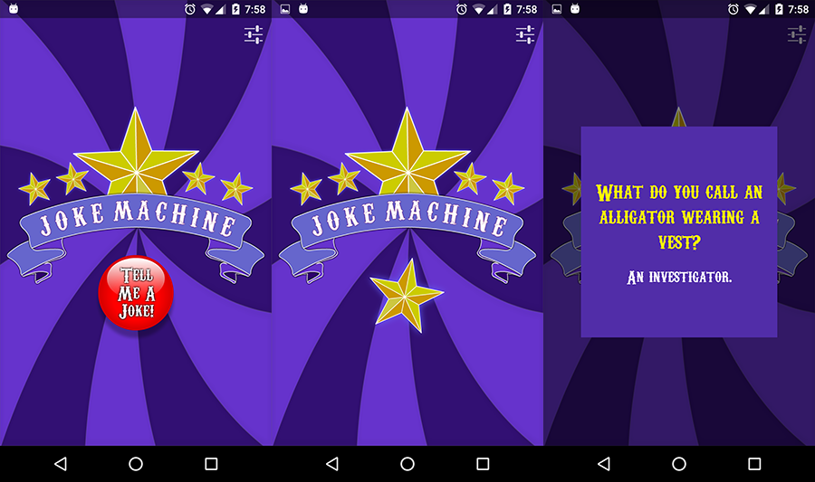
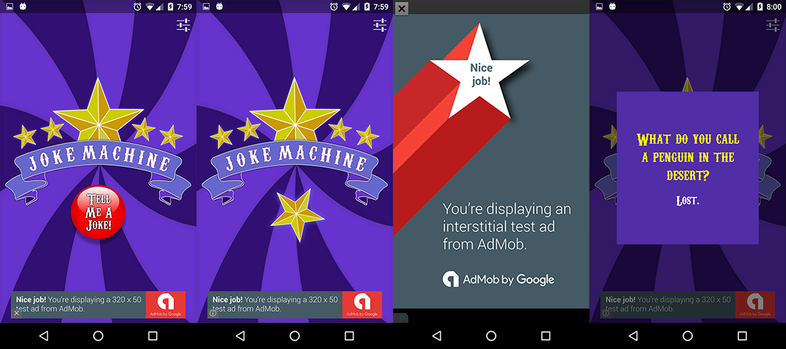

# AndroidNanoDegreeProject4
Udacity Android Developer Nano Degree Project 4 - Build it Bigger

The goal for this project was to develop an app which had two distinct flavours - one paid and one free which could communicate with an instance of a Google Cloud Endpoints server to display jokes.

In particular, the requirements were:

- Create an Android app with two flavours - free and paid.
- Create an Android library.
- Create a Java library.
- Create a Google Cloud Endpoint server library.
- Write an integration test and Gradle task which would start a local server instance, execute the integration test and shut down the local server instance.
- Integrate Google Ads, including an interstitial ad for the free version.
- Include a loading indicator.

## Paid



## Free



## Notes

The free flavour of the app includes the Google Ads dependencies and code / resources whereas the paid flavour does not. In particular, by using the Android flavours system, the paid version shares no dependencies, code or resources related to the Google Ads implementation.

The free flavour will display a banner ad on the home screen, and after retrieving a joke from the GCE server, will display an interstitial ad before presenting the joke.

## Running the solution

To run the GCE server, execute the following command (or you can start it from Android Studio from the run profile dropdown):

```bash
./gradlew startLocalServer
```

This should compile and start the local GCE server. If you run the Android app (free or paid) in an emulator, you should be able to successfully connect to the GCE server.

To stop the local server, run this Gradle task:

```bash
./gradlew stopLocalServer
```

If you want to run the app on a real device, you'll need to follow these steps:

1. Connect device to USB port on machine.
2. Start Google Chrome on your desktop.
3. Navigate to *chrome://inspect*.
4. Make sure that *Port Forwarding* is enabled and that your device appears in the browser.
5. Start *Chrome* on your Android device and leave it running in the background to allow the local machine port forwarding to work.
6. Run the Android app on the device and tap the settings icon.
7. Tap the *Server Base Url* and change it from *10.0.2.2* to *localhost*.
8. Make sure your local server is running (use the *startLocalServer* task to boot it up).
9. Your Android device should now be able to connect to your locally hosted GCE server.

[Google Chrome USB Debugging documentation](https://developers.google.com/web/tools/chrome-devtools/debug/remote-debugging/remote-debugging?hl=en#remote-debugging-on-android-with-chrome-devtools)

## Running the integration test

There is a custom Gradle task written specifically to execute an endpoint integration test against a local GCE instance.

The integration test Gradle task can be executed without starting the local server manually - it will do it on its own.

You only need to make sure that you have an emulator running, or a real Android device that has been configured with port forwarding.

Run the following command to execute the integration test:

```bash
./gradlew runJokeMachineIntegrationTests
```

If all goes well, the task will start a local instance of the GCE server, run an Android instrumented test which fetches a joke and validates it, the shuts down the local instance of the GCE server.

## Summary

I enjoyed working on this project - I feel that the GCE implementation produces code that is a bit more tightly coupled than I'd prefer (you consume generated classes from the GCE module), but it was a good learning exercise and an interesting problem to solve in splitting paid vs free dependencies, code and resources.

Marcel.

###Licence

Copyright 2016 Marcel Braghetto

Licensed under the Apache License, Version 2.0 (the "License");
you may not use this file except in compliance with the License.
You may obtain a copy of the License at

    http://www.apache.org/licenses/LICENSE-2.0

Unless required by applicable law or agreed to in writing, software
distributed under the License is distributed on an "AS IS" BASIS,
WITHOUT WARRANTIES OR CONDITIONS OF ANY KIND, either express or implied.
See the License for the specific language governing permissions and
limitations under the License.
