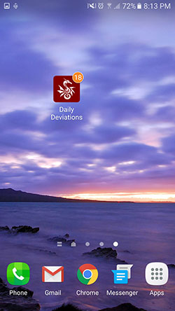
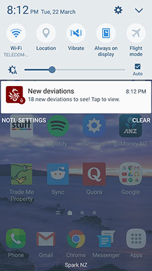
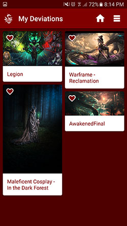
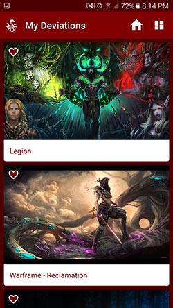

# AndroidNanoDegreeProject5
Udacity Android Developer Nano Degree Project 5 - Make your app material

[Download and install DailyDeviations.apk to try it out!](Support/ReadMeAssets/DailyDeviations.apk)

The goal for this project was to take a basic existing app with no material design components or treatment and apply a material design experience from it.

I chose to develop an app that at its core:

- Loads and parses an RSS data feed from http://www.deviantart.com/ which is updated daily.
- Allows the user to browse the feed in a RecyclerView with a Staggered Grid Layout Manager and to mark artworks as 'favourites' to view in a secondary view.
- Adapt to different form factors, adjusting the number of columns and layout widget properties.
- Provide shared element transitions for Lollipop and later.
- Provide pinch to zoom and panning to explore images.
- Provide subtle animations to enhance the experience.

In addition, I also included:

- Local notifications and background data refreshing using Alarm Manager and broadcast receivers.
- App icon 'badging', showing how many artworks are available but haven't been seen before (this only works on certain Android device classes such as Samsung phones).

It was heaps of fun to experiment with material design animations and transitions and to create some of my own subtle animations - like the rotating / cross fading toolbar action buttons which you can't see in the static screenshots.

Marcel.

###Licence

Copyright 2016 Marcel Braghetto

Licensed under the Apache License, Version 2.0 (the "License");
you may not use this file except in compliance with the License.
You may obtain a copy of the License at

    http://www.apache.org/licenses/LICENSE-2.0

Unless required by applicable law or agreed to in writing, software
distributed under the License is distributed on an "AS IS" BASIS,
WITHOUT WARRANTIES OR CONDITIONS OF ANY KIND, either express or implied.
See the License for the specific language governing permissions and
limitations under the License.
