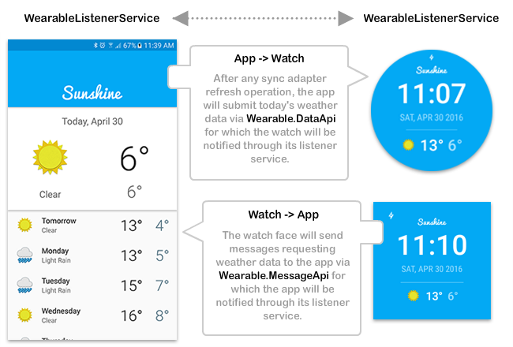

# AndroidNanoDegreeProject6
Udacity Android Developer Nano Degree Project 6 - Go Ubiquitous



The goal for this project was to take an existing base app from Udacity with no **Android Wear** integration and develop a watch face and wearable app to be able to see the current weather for today on a watch face.

Key goals were:

- Create an **Android Wear** app alongside the existing main app.
- Create a custom **watch face** in the wear app which adheres to the guidelines for creating watch faces.
- Use the Android wear APIs to provide communication between the main app and the watch face to keep the current weather conditions in sync.

[The original foundation app for this project can be found here.](https://github.com/udacity/Advanced_Android_Development/tree/7.05_Pretty_Wallpaper_Time)

###My changes

I decided to **rewrite the entire foundation app** using my own code design patterns and preferred architecture.

In doing so I removed a number of features from the foundation app that were not relevant to producing an **Android Wear** app - basically to remove some of the noise in the app so the focus was on the watch face integration.

The refactored app uses a static default location for determining the weather. The ability to select different locations wasn't the focus of this project.

The refactored app still contains a few elements from the original foundation app:

- The weather icon drawables.
- A collection of weather condition strings related to the weather ID codes returned from the Open Weather API.
- A handful of utility methods for formatting the strings used when presenting weather conditions.

All other code is new but written to achieve the same app behaviour as the foundation app.

###Open Weather API key

You will need to obtain your own **Open Weather API key** in order for the app to fetch weather data.

[Visit this link to get one](http://openweathermap.org/appid)

Once you have an API key, you have two choices on how to include it in the app.

**Choice 1 - Gradle properties file**

- Edit your **~/.gradle/gradle.properties** file. You can edit it directly through Android Studio or find it on your machine manually. If you don't have this file just create it.
- Enter the following line into the properties file:

```
WEATHER_API_KEY="YOUR_API_KEY_HERE"
```

**Choice 2 - Edit app Gradle file**

- Edit the **build.gradle** file for the **app** module.
- Find the following script block:

```
    buildTypes.each {
        // The WEATHER_API_KEY will need to exist in your global gradle.properties file.
        // Get an API key at: http://openweathermap.org/appid
        it.buildConfigField 'String', 'OPEN_WEATHER_MAP_API_KEY', WEATHER_API_KEY
    }
```
- Replace the ```WEATHER_API_KEY``` script variable with your API key enclosed in quotes, eg:

```
    buildTypes.each {
        // The WEATHER_API_KEY will need to exist in your global gradle.properties file.
        // Get an API key at: http://openweathermap.org/appid
        it.buildConfigField 'String', 'OPEN_WEATHER_MAP_API_KEY', 'YOUR_API_KEY_HERE'
    }
```

###How to run

Google have a fairly comprehensive guide to get your development environment working for **Android Wear** integration.

[Visit this link for the docs](http://developer.android.com/training/wearables/apps/creating.html)

In particular, make sure to use the following terminal command after the phone and watch emulator are up and running:

```
adb -d forward tcp:5601 tcp:5601
```

You may also need to enable **ADB Debugging** on the watch emulator itself via **Developer Options**.

### Interesting notes

During the development of this project I learned a few things along the way of note:

- You cannot send complex classes easily via the ```Wearable.DataApi.putDataItem``` API. Although there are ways to marshall complex objects using different serialization techniques, the preferred way is to represent a complex object as a **bundle** of key value pairs (or sub bundles) which can be used to reform the data on the receiving side.
- A watch face does not respect the resource qualifiers related to screen DP sizes in the way you expect. For example, having resources in a folder ```layout-sw360dp``` will **NOT** detect a wear device with a 360 **pixel** sized display.
- Although a **watch face** is effectively a blank canvas to draw on, it is still possible to use standard Android layout XML files with some small tweaks to the rendering code. In my opinion this is **much nicer** than manually having to paint everything via code in **onDraw**.

Marcel.

###Licence

Copyright 2016 Marcel Braghetto

Licensed under the Apache License, Version 2.0 (the "License");
you may not use this file except in compliance with the License.
You may obtain a copy of the License at

    http://www.apache.org/licenses/LICENSE-2.0

Unless required by applicable law or agreed to in writing, software
distributed under the License is distributed on an "AS IS" BASIS,
WITHOUT WARRANTIES OR CONDITIONS OF ANY KIND, either express or implied.
See the License for the specific language governing permissions and
limitations under the License.

