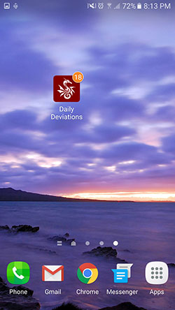
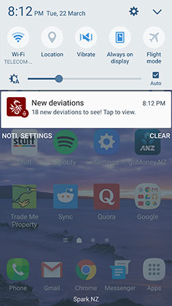
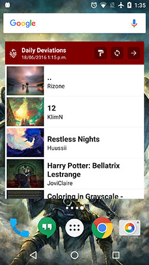
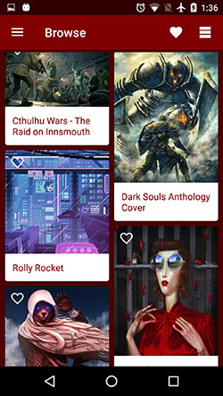
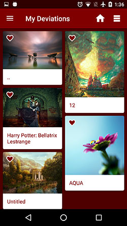
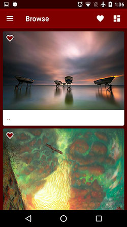
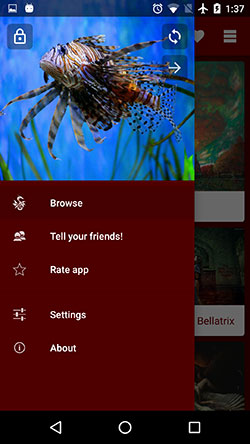
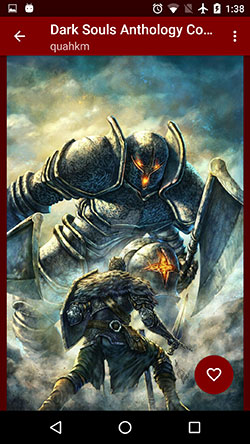
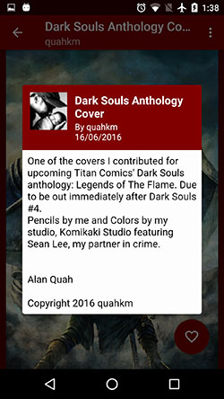
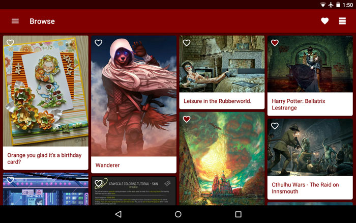

# AndroidNanoDegreeProjectCapstone
Udacity Android Developer Nano Degree Project - Capstone

This is the final project submission for the Android Nano Degree course from Udacity. It is comprised of two phases:

###Phase 1

Submission of design document for final 'capstone' app project.

###Phase 2

Submission of the capstone app developed to the spec in the design document.

# Daily Deviations

The assignment was to develop a rich Android app of my choosing. The core feature of the app is to consume a RSS feed from the [Deviant Art web site]("http://www.deviantart.com/) and let the user know when there are new ***Daily Deviations***.

###Try the app!

You can build and install the app from the command line:

```
./gradlew installRelease
```

or you can [download and install DailyDeviations.apk to try it out!](Support/ReadMeAssets/DailyDeviations.apk)

###Run the tests!

There is a suite of unit tests written against Robolectric which can be run with:

```
./gradlew testDebugUnitTest
```

The test report can be found in the folder:

```
app/build/reports/tests/debug/index.html
```

Some of the key elements of developing this app were:

- All UI code is driven by the Android DataBinding framework - there is no 'findViewById' or Butterknife code.
- Content provider driven data source.
- Shared element transitions for Lollipop and above.
- Background data refreshing and local notifications.
- Persistent settings.
- Interactive navigation drawer.
- Home screen widget with interactive features.
- Integration of Google Firebase.
- A bunch of other cool tricks that I came up with (animations etc).

Notes:

- The 'Rate App' menu item will not work because this app is not currently published in Google Play.
- The Google Play Service configuration for this project is not included in this code base so some Google Play Services specific features may not operate.

This was a heap of fun to develop and I made it the way I liked to use this kind of app.












###Libraries

The libraries used in the app were:

**Android Support libraries**

- AppCompat
- CardView
- RecyclerView
- Design.

**Google Play Services**

- Firebase Analytics
- Firebase App Invites.

**Google Dagger 2**

- [http://google.github.io/dagger/](http://google.github.io/dagger/)

**Android APT**

- [https://bitbucket.org/hvisser/android-apt](https://bitbucket.org/hvisser/android-apt)

**Square OkHttp**

- [http://square.github.io/okhttp/](http://square.github.io/okhttp/)

**GreenRobot EventBus**

- [https://github.com/greenrobot/EventBus](https://github.com/greenrobot/EventBus)

**Glide**

- [https://github.com/bumptech/glide](https://github.com/bumptech/glide)

**PhotoView**

- [https://github.com/chrisbanes/PhotoView](https://github.com/chrisbanes/PhotoView)

**Joda-Time**

- [https://github.com/JodaOrg/joda-time](https://github.com/JodaOrg/joda-time)

**Parceler**

- [https://github.com/johncarl81/parceler](https://github.com/johncarl81/parceler)

**ShortcutBadger**

- [https://github.com/leolin310148/ShortcutBadger](https://github.com/leolin310148/ShortcutBadger)

**Robolectric**

- [http://robolectric.org/](http://robolectric.org/)

**Mockito**

- [https://github.com/mockito/mockito](https://github.com/mockito/mockito)

###Licence

Copyright 2016 Marcel Braghetto

Licensed under the Apache License, Version 2.0 (the "License");
you may not use this file except in compliance with the License.
You may obtain a copy of the License at

    http://www.apache.org/licenses/LICENSE-2.0

Unless required by applicable law or agreed to in writing, software
distributed under the License is distributed on an "AS IS" BASIS,
WITHOUT WARRANTIES OR CONDITIONS OF ANY KIND, either express or implied.
See the License for the specific language governing permissions and
limitations under the License.
